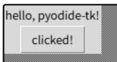

# PyodideTk

⚠️ This project is in early development and is not yet stable. Expect breaking changes and missing features.

Run Tkinter with Python in the browser.



Built on top of [Pyodide](https://pyodide.org/); Tk's X11 calls are handled by the sibling project [em-x11](https://github.com/DevScholar/em-x11). Optional Tcl→DOM bridge commands (`::tcldide::dom`, `::tcldide::jscall`) are built from the sibling [tcldide](https://github.com/DevScholar/tcldide) project's `opt/tcldide.c`.

# Prerequisites

- Linux
- Emscripten 5.0.3 (`emcc` must be on `PATH`)
- Node.js ≥ 20, pnpm ≥ 9
- [em-x11](https://github.com/DevScholar/em-x11) cloned as a sibling directory (Makefile auto-builds the native/ subset — no manual build needed)
- [tcldide](https://github.com/DevScholar/tcldide) cloned as a sibling directory (**optional** — only needed for `::tcldide::*` Tcl→DOM commands)
- Pyodide xbuildenv — provides `Python.h` from a wasm-EH CPython build. Two options:

  **Flow A — pre-built xbuildenv (simpler):**
  ```bash
  pip install pyodide-build
  pyodide xbuildenv install 0.34.3
  ```

  **Flow B — build Pyodide from source:**
  ```bash
  git clone https://github.com/pyodide/pyodide.git ../pyodide
  cd ../pyodide && make
  ```
  See [Building from sources](https://pyodide.org/en/stable/development/building-from-sources.html) for full details.
  The Makefile auto-detects `../pyodide/xbuildenv` when Pyodide is cloned as a sibling.

Regardless of flow, the Pyodide browser runtime (`pyodide.asm.wasm`, `pyodide.mjs`, etc.) is sourced from one of:
- `$PYODIDE_DIST` env var — set to `<pyodide-source>/dist` if you built from source
- `node_modules/pyodide` — the npm package (installed by `pnpm install`)
- Both `setup.sh` and `stage-assets.sh` honor `PYODIDE_DIST`.

# Quick start

```bash
pnpm install   # downloads sources, builds .so side modules, stages assets
pnpm dev       # starts Vite dev server
```

`pnpm install` detects missing external dependencies (em-x11, xbuildenv) and prints install instructions if any are absent. Install them and re-run `pnpm install`.

# Build

```bash
pnpm build     # build:native → stage-assets → build:web (vite)
```

# Run

```bash
pnpm dev
```

# Known Issues

These are known issues that remain unresolved despite repeated attempts.

- In EmX11, running both TWM and Tcldide simultaneously causes the web page to freeze.

- When attempting to open any dialog box in Common Dialogs, the web page freezes.

# License

MIT (see [LICENSE.md](LICENSE.md)).
